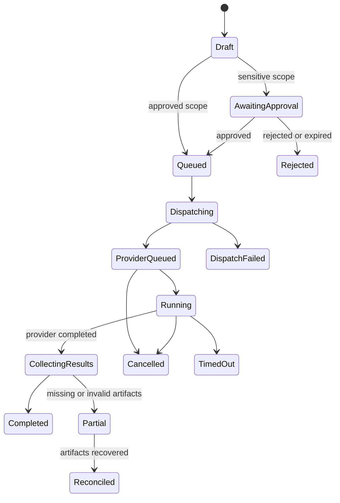
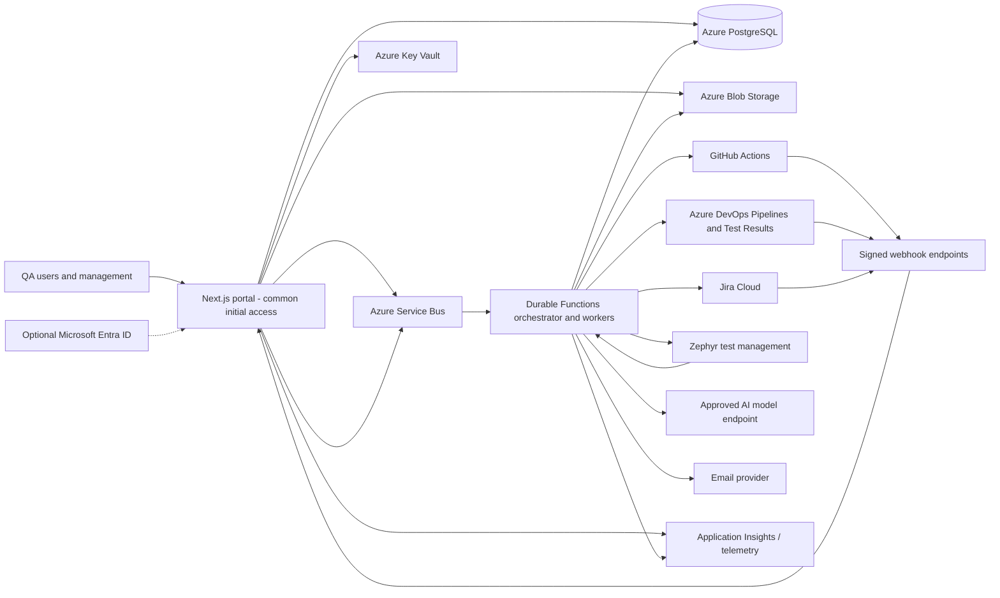

# Central QA Portal — Product, Analytics, and Architecture Plan

**Status:** Planning only — no implementation has started  
**Prepared:** 15 August 2026  
**Teams in initial scope:** MBS and SCL  
**Proposed application style:** Next.js full-stack modular monolith with managed asynchronous workers

---

## 1. Executive recommendation

Build one internal QA portal with four connected capabilities:

1. **Quality intelligence** — a trusted view of manual testing, automation, coverage, defects, execution health, trends, and application risk.
2. **Test operations** — a controlled UI for finding, scheduling, and triggering approved test packs in GitHub Actions or Azure DevOps (ADO), then following the run to completion.
3. **QA management** — project- and team-level views covering delivery progress, capacity, automation migration, bottlenecks, quality debt, and trends over time.
4. **AI-assisted insight** — evidence-linked summaries, anomaly explanations, run triage, and weekly narratives; AI should summarize project and team progress, never evaluate people.

The recommended system is **one Next.js application for the UI, server rendering, APIs, configuration, and normal mutations**, plus a small managed asynchronous execution layer using Azure Service Bus and Azure Durable Functions. This retains a single product/codebase mindset without asking a request/response web process to own workflows that may run for hours. Next.js itself describes its backend capability as a backend-for-frontend rather than a complete replacement for every backend workload, and notes that some hosting models terminate long-running handlers ([Next.js backend-for-frontend guide](https://nextjs.org/docs/app/guides/backend-for-frontend)). Azure Durable Functions checkpoints and recovers long-running orchestration state ([Microsoft Durable Functions overview](https://learn.microsoft.com/en-us/azure/durable-task/durable-functions/durable-functions-overview)).

PostgreSQL should store normalized operational and analytical data; Azure Blob Storage should retain large/raw artifacts such as JUnit XML, Playwright reports, screenshots, logs, and coverage files. Azure Service Bus gives durable decoupling between the portal and workers, including dead-letter handling and at-least-once delivery ([Azure Service Bus queues](https://learn.microsoft.com/en-us/azure/service-bus-messaging/service-bus-queues-topics-subscriptions)).

The portal should begin as a **system of insight and orchestration**, not immediately replace Jira, GitHub/ADO, or an existing test-management product. It should preserve source links and source identifiers so users can always drill back to the authoritative system.

---

## 2. Product goals

### 2.1 Goals

- Give MBS, SCL, their verticals, applications, and modules one consistent quality view.
- Distinguish different forms of coverage instead of publishing one misleading “coverage” number.
- Show weekly, monthly, quarterly, and yearly progress with stable metric definitions.
- Make automated test execution discoverable and safe for QAs who do not work directly in CI/CD tools.
- Normalize results from GitHub Actions and ADO without hiding the original logs and artifacts.
- Show understandable manual effort, automation effort, approximate time saved, test progress, and the UFT-to-SandsARC migration trend without complicated scoring models.
- Give QA directors a project- and team-progress view rather than a wall of test counts.
- Use Jira assignments only to understand team workload, bandwidth, blockers, and where help may be needed—not to measure individual performance.
- Provide trustworthy AI summaries with data freshness, evidence links, and clear limitations.
- Maintain auditable access, trigger history, configuration history, and metric lineage.

### 2.2 Non-goals for the first release

- Replacing Jira as the work-management system.
- Replacing GitHub Actions or ADO as the execution engine.
- Replacing Zephyr as the test-case management system for manual and automated tests.
- Using code coverage as a proxy for business-risk coverage.
- Calculating or presenting individual QA performance KPIs, rankings, productivity scores, or comparisons.
- Allowing AI to trigger tests, change quality gates, or evaluate employees autonomously.
- Copying all CI logs into PostgreSQL; large artifacts belong in object storage.

---

## 3. Design principles

1. **Project progress before performance scoring.** The portal exists to show the state and direction of QA work, not to score employees.
2. **Separate unlike metrics.** Requirement coverage, risk coverage, automation coverage, execution coverage, and code coverage must not be blended into one percentage.
3. **Keep metrics simple.** Use direct counts, percentages, time trends, and clearly labeled estimates that a QA team can readily verify.
4. **Trend before snapshot.** Current values must be paired with baselines, targets, and movement.
5. **Source traceability.** Every summary drills down to applications, modules, requirements, test cases, runs, defects, Jira worklogs, or CI artifacts.
6. **Team context.** MBS and SCL can use the same metric dictionary while retaining different targets and risk profiles.
7. **Safe orchestration.** Least privilege, allowlisted workflows, validated inputs, concurrency controls, approvals for sensitive environments, and a complete audit trail.
8. **No individual performance measurement.** Named Jira assignment data may be used only to see workload and bandwidth so work can be balanced and help can be offered. It must not feed performance trends, rankings, targets, or AI judgments. Microsoft/GitHub’s SPACE research also warns that productivity cannot be represented by one activity metric ([SPACE framework paper](https://www.microsoft.com/en-us/research/publication/the-space-of-developer-productivity-theres-more-to-it-than-you-think/)).
9. **AI outputs are derived artifacts.** Store the evidence window, model/configuration version, generation time, and source links with each summary.
10. **Data quality is visible.** Missing mappings, stale integrations, late results, and estimated values must be labeled rather than silently treated as facts.

---

## 4. Access model

### 4.1 Initial phase

Do **not** implement application roles, page restrictions, team scoping, or management-only screens in the initial phase. Everyone using the portal can see all MBS and SCL dashboards, Jira workload views, applications, runs, and management pages.

If Microsoft Entra ID single sign-on is enabled initially, use it only to keep the portal internal and identify who initiated operational actions such as a test run. Every signed-in portal user receives the same application access. If the hosting environment already limits the portal to the intended internal audience, Entra SSO itself may also be deferred.

Operational safety is still required even without portal roles:

- Only preconfigured, allowlisted workflows and pipelines can be triggered.
- Pipeline parameters, branches, and environments are validated.
- Integration credentials are never shown to users.
- Trigger, cancellation, configuration, and integration events are audited.
- Provider-side GitHub/ADO permissions and service identities remain least-privileged.

### 4.2 Future access model

When access separation becomes necessary, introduce only two application access levels:

| Access level | Intended access |
|---|---|
| All QA | General dashboards, applications, Zephyr coverage, test catalog, triggering, runs, results, and team-level progress |
| Management | Everything in All QA plus management-focused pages and any named Jira workload/bandwidth view selected for restricted use |

Microsoft Entra ID groups can later map directly to these two application access levels. Do not add team-, vertical-, application-, or feature-specific role logic unless a future requirement explicitly justifies it.

---

## 5. Information architecture

### 5.1 Main navigation

1. **Home**
   - My applications, active incidents/runs, stale data warnings, recent outcomes, AI briefing.
2. **Quality Analytics**
   - Executive overview, coverage, manual vs automation, defects, test health, trends.
3. **Applications**
   - Team → vertical → application → module drill-down.
4. **Test Operations**
   - Test catalog, trigger, schedules, live runs, result history, failure triage.
5. **Manual QA**
   - Plans/cycles, executions, evidence, backlog, effort, exploratory sessions.
6. **Automation**
   - Candidate backlog, automated inventory, framework health, flaky tests, maintenance debt.
7. **Management** (visible to everyone in the initial phase)
   - Portfolio risk, progress, capacity/allocation, value/time saved, bottlenecks, data quality.
8. **Integrations & Administration**
   - GitHub, ADO, Jira, Zephyr, email, AI, taxonomy, framework mappings, audit, retention.

### 5.2 Shared filter bar

All analytical pages should support consistent filters:

- Date range and comparison period
- Team: All / MBS / SCL
- Vertical
- Application
- Module or business capability
- Environment
- Release/version
- Test level: unit / component / API / integration / UI / end-to-end / performance / security / accessibility
- Execution type: manual / automated
- Automation framework: UFT / SandsARC-Cucumber / SandsARC-TestNG / other
- Migration status: UFT / migration planned / in progress / migrated / validated
- Risk tier and criticality
- Source system

Filters must be encoded in the URL so a view can be bookmarked or shared. Future Management-only pages can apply the two-level access model when it is introduced.

---

## 6. Organization and quality taxonomy

Use a stable hierarchy and avoid deriving organizational meaning from repository names:

```text
Company
├── MBS
│   ├── Vertical
│   │   ├── Application
│   │   │   ├── Module / business capability
│   │   │   └── Critical journey / requirement
└── SCL
    ├── Vertical
    │   ├── Application
    │   │   ├── Module / business capability
    │   │   └── Critical journey / requirement
```

Each application should have:

- Business owner, technical owner, QA owner, and backup owner
- Team and vertical
- Criticality/risk tier
- Lifecycle state
- Repositories and ADO projects/pipelines
- Jira projects/components
- Supported environments
- Release cadence
- Required quality gates
- Test framework(s) and result formats
- Manual baseline duration and review date
- Data classification and retention rules

Support cross-team applications through a many-to-many ownership table instead of duplicating them.

---

## 7. Project and team progress metrics

The dashboard metrics are operational project-progress indicators. They are not employee-performance KPIs and should not be described or used that way.

### 7.1 Simple coverage views

Coverage must still identify its denominator, but the portal does not need a weighted composite score or complicated KPI engine. Zephyr should be the primary source for manual and automated test-case inventory and execution coverage.

| Progress metric | Simple calculation | Main source | Suggested visual |
|---|---|---|---|
| Total test cases | Count of active test cases | Zephyr | Number and trend |
| Manual test cases | Active cases marked manual | Zephyr | Stacked bar by application |
| Automated test cases | Active cases linked to automation | Zephyr + framework mapping | Stacked bar by application |
| Automation coverage | Automated test cases / automation-eligible test cases | Zephyr | Progress bar and trend |
| Requirement coverage | In-scope requirements with at least one linked test / in-scope requirements | Jira + Zephyr | Percentage and gap list |
| Regression execution progress | Executed planned cases / planned regression cases | Zephyr + CI results | Burn-up/progress bar |
| Overall test execution result | Passed, failed, blocked, not executed | Zephyr + CI results | Stacked bar |
| Code coverage | Direct statement/branch coverage reported by SandsARC or other supported frameworks | CI coverage artifact | Trend by application/module |

Do not combine these into a Quality Protection Index or employee score. A simple “Overall QA Progress” page can place the separate cards together with clear labels.

### 7.2 Management project-progress views

The management page should answer straightforward questions:

#### A. What is the current testing progress?

- Planned, executed, passed, failed, blocked, and not-executed test counts
- Progress by MBS, SCL, vertical, application, module, release, and week/month/year
- Manual vs automated test inventory and execution
- Open defects by severity, application, release, and age
- Applications or releases with incomplete regression testing
- Environment or test-data blockers

#### B. How healthy is automation?

- Runs and pass/fail trend
- First-run result and final result after reruns
- Flaky or repeatedly failing tests
- Average execution duration and long-running suites
- Cancelled, timed-out, or infrastructure-failed runs
- Automation maintenance backlog

Azure Test Analytics similarly focuses on pass-rate trends, failures, duration, and flaky behavior ([Azure Test Analytics](https://learn.microsoft.com/en-us/azure/devops/pipelines/test/test-analytics?view=azure-devops)).

#### C. How is the UFT-to-SandsARC migration progressing?

- Total UFT tests in scope
- Migration not started / planned / in progress / migrated / validated
- UFT tests retired after successful SandsARC validation
- SandsARC Cucumber vs TestNG inventory
- Migration progress by team, vertical, application, and module
- New tests created directly in SandsARC
- Remaining UFT execution and maintenance effort
- Migration blockers and aging

#### D. How is QA effort distributed?

- Manual QA vs Automation QA vs combined QA effort
- Test design, execution, automation development, migration, maintenance, triage, test data, environment support, and release support
- Planned vs unplanned work
- Work in progress and blocked work
- Team capacity/bandwidth and areas needing help
- Approximate manual time avoided through automation

### 7.3 Simple metric definitions

| Metric | Definition |
|---|---|
| Pass rate | Passed executions / completed executions; show skipped, blocked, and not-executed separately |
| Automation coverage | Automated active tests / automation-eligible active tests |
| Migration completion | UFT tests validated in SandsARC / total UFT tests approved for migration |
| Manual effort | Jira worklog hours categorized as manual QA work for the selected period |
| Automation effort | Jira worklog hours categorized as automation, migration, maintenance, or automation triage |
| Approximate manual hours avoided | Successful automated executions that replaced planned manual execution × agreed manual baseline time |
| Workload/bandwidth | Open assigned work, remaining estimate, due dates, WIP, blockers, and known availability; not a performance score |
| Data freshness | Time of the last successful Jira, Zephyr, GitHub, or ADO synchronization |

For manual time saved, show the baseline and label the result as an estimate. Do not calculate currency ROI, employee productivity, cost per tester, or break-even unless a future requirement specifically asks for it.

Each metric only needs a lightweight definition record: name, description, calculation, source, refresh time, and known limitation.

---

## 8. Jira integration and QA effort model

### 8.1 Recommended approach

Use Jira as the source for planned work, assignments, status, estimates, blockers, due dates, and worklogs. The purpose is to understand overall Manual QA, Automation QA, and combined QA workload and to spot people who may be overloaded or have bandwidth to help. It is explicitly not a performance-measurement feature.

Jira time tracking must be enabled for the worklog API, and returned worklogs respect project, issue-security, and worklog visibility permissions ([Jira worklog API](https://developer.atlassian.com/cloud/jira/platform/rest/v2/api-group-issue-worklogs/)). Use:

- **Assignments, open work, remaining estimates, due dates, and WIP** for current workload/bandwidth.
- **Blocked status and blocker age** to show where someone needs help.
- **Worklogs grouped at Manual QA, Automation QA, project, and team level** for effort distribution.
- **Planned availability**, if the organization has a reliable source for leave or planned allocation.
- **Zephyr and CI execution telemetry** for test progress; Jira should not be forced to represent test execution details already held elsewhere.

Do not derive an individual productivity rate from status duration, hours, ticket count, defects, or completed work. Do not infer low performance from available bandwidth or high performance from over-allocation.

### 8.2 QA work taxonomy

Create a controlled `QA Work Category` field or equivalent mapping:

- Test analysis and planning
- Test-case design/review
- Manual functional execution
- Exploratory testing
- Regression/release support
- UFT-to-SandsARC migration
- Automation design/development
- Automation maintenance/refactoring
- Failure triage and defect reproduction
- Defect verification
- Test data preparation
- Environment/support issue
- Performance/security/accessibility testing
- Meetings/coordination
- Learning/enablement

Also capture or map:

- Team and vertical
- Application/module
- Release/fix version
- Test level/type
- Planned vs unplanned
- Automation candidate: yes/no/not eligible
- Risk/criticality
- Blocked reason
- Linked test run/test case/defect where available

Keep required fields minimal; excessive time-sheet behavior reduces data quality. Start with existing Jira fields and introduce only what is required to understand project progress, workload, and blockers.

### 8.3 Team progress and bandwidth views

#### Manual QA, Automation QA, and overall QA summaries

- Weekly/monthly allocation by work category
- Planned vs unplanned allocation
- Demand vs available capacity
- Open work, WIP, due-soon work, and blocked-work trend
- Automation build vs maintenance balance
- UFT migration vs new SandsARC automation effort
- Manual regression effort and trend
- Applications consuming the most QA effort
- Effort spent on defects, environments, and rework

#### Named workload/bandwidth list

- Show only information useful for work balancing: assigned open items, remaining estimate, WIP, due dates, blockers, and planned availability when available.
- Use neutral states such as `Available`, `Balanced`, `High load`, `Blocked`, and `Unknown data`, based on simple configurable thresholds.
- Allow leads to see who can help and who may need support.
- Do not show individual pass rates, cases executed, defects found, hours-versus-output, completion rankings, trend scores, or performance labels.
- Do not create leaderboards, composite scores, “top performer” indicators, or employee targets.
- AI may summarize team-level workload and blockers but must not comment on an individual’s performance.
- The list is visible to everyone in the initial phase. It may move under the future Management access level if the company later chooses to restrict it.

### 8.4 Sync design

- Initial backfill by project/date-bounded JQL.
- Incremental issue sync using webhooks plus scheduled reconciliation.
- Incremental worklog sync using updated/deleted worklog endpoints.
- Persist source IDs, source update timestamps, and content hashes for idempotency.
- Use the current enhanced JQL search endpoint; Atlassian documents older search operations as being removed ([Jira enhanced JQL search](https://developer.atlassian.com/cloud/jira/platform/rest/v3/api-group-issue-search/)).
- Handle `429` responses, `Retry-After`, exponential backoff with jitter, quotas, and a visible sync health page. Jira Cloud currently documents points-based, burst, and per-issue write limits ([Jira rate limiting](https://developer.atlassian.com/cloud/jira/platform/rate-limiting/)).
- Prefer OAuth 2.0 (3LO) or an approved enterprise app integration over embedding a person’s API token.
- Store only fields needed for project progress and workload balancing, and honor Jira issue/worklog visibility.

---

## 9. Test catalog and triggering

### 9.1 Current automation framework landscape

The portal must support the current state and the target state at the same time:

| Framework | Position | Typical execution | Portal treatment |
|---|---|---|---|
| UFT | Legacy framework with existing automated coverage | Primarily ADO pipelines | Continue ingesting and triggering approved UFT suites while migration is active |
| SandsARC with Cucumber | Strategic Java-based framework for business-readable scenarios | GitHub Actions and/or ADO, depending on project setup | Preferred framework for migrated and new Cucumber automation |
| SandsARC with TestNG | Strategic Java-based framework for TestNG suites | GitHub Actions and/or ADO, depending on project setup | Preferred framework for migrated and new non-Cucumber/TestNG automation |

All new automation projects should be registered as SandsARC. Existing UFT tests should retain their history while being linked to the replacement SandsARC test. A migration record should include:

- Zephyr test-case ID
- Team, application, and module
- Legacy UFT test/suite identity and ADO pipeline
- Target SandsARC type: Cucumber or TestNG
- Target repository and workflow/pipeline
- Migration status: `Not started`, `Planned`, `In progress`, `Migrated`, `Validated`, `UFT retired`, or `Exception`
- Migration owner, target date, blocker, and notes
- Validation evidence and date

Do not count a test as fully migrated when code is merely created. Mark it complete only after the SandsARC replacement is linked to the Zephyr case, executes successfully in the intended pipeline/environment, and the team confirms whether the UFT version can be retired.

### 9.2 Zephyr test-case management

Zephyr is the source of truth for both manual and automated test cases. The portal should synchronize rather than recreate:

- Test cases, folders/suites/cycles, labels, priority, status, and ownership metadata
- Manual vs automated classification
- Requirement/story links
- Test execution cycles and results
- Automation linkage to UFT or SandsARC
- Application/module/team mappings
- Zephyr test-case URL and stable source identifier

The exact Zephyr product and deployment must be confirmed during discovery because API capabilities and object names differ across Zephyr variants. The portal integration should use an adapter so the rest of the system works with a normalized test-case and execution model.

The preferred traceability chain is:

```text
Jira requirement/story
  → Zephyr test case
    → manual execution OR automated implementation
      → UFT / SandsARC Cucumber / SandsARC TestNG
        → GitHub Actions or ADO run
          → normalized portal result and evidence
```

### 9.3 Catalog model

The UI should not expose arbitrary workflow names or free-form pipeline parameters. Approved portal configuration registers **Test Definitions**:

- Display name and description
- Team/vertical/application/module
- Zephyr test-case IDs, suite/cycle, tags, and framework
- Test level and risk tier
- Framework: UFT, SandsARC Cucumber, SandsARC TestNG, or approved other
- Execution provider: GitHub Actions or ADO
- Repository/project/pipeline/workflow identity
- Allowed branches and environments
- Typed inputs, defaults, validation, and secrets policy
- Estimated duration and resource cost class
- Concurrency group and maximum parallel runs
- Optional operational approval for sensitive pipelines; no portal role restriction in the initial phase
- Result parser and artifact locations
- Owner, support link, runbook, and lifecycle state

### 9.4 Trigger user journey

1. Select team, application, module, environment, suite/tags, branch/version.
2. Preview resolved tests, estimated duration, last result, known flaky tests, and environment health.
3. Validate the allowlisted definition, input schema, concurrency, freeze windows, and operational policy.
4. For sensitive runs, request approval with expiry.
5. Create an immutable portal run ID and idempotency key.
6. Enqueue a trigger command.
7. Orchestrator calls GitHub or ADO and stores the provider run ID/URL.
8. UI follows the local state in near-real time and links to provider logs.
9. Webhook updates state; reconciliation polling covers lost/delayed events.
10. Worker downloads/parses result and coverage artifacts, stores normalized facts, and retains raw artifacts in Blob Storage.
11. Recompute affected snapshots/aggregates.
12. Notify subscribed recipients with a portal link and concise outcome.

### 9.5 Run state machine



State updates must be monotonic where possible. Every webhook and polling update is idempotent. A user retry creates a new attempt linked to the original run unless the original trigger is proven not to have reached the provider.

### 9.6 GitHub Actions integration

- Use a GitHub App, not a personal access token. GitHub recommends appropriate fine-grained app tokens and says GitHub Apps should not authenticate with personal access tokens ([GitHub App best practices](https://docs.github.com/en/apps/creating-github-apps/about-creating-github-apps/best-practices-for-creating-a-github-app)).
- Grant only the repositories and permissions required; GitHub Apps have no permissions by default and support least-privilege selection ([GitHub App permissions](https://docs.github.com/en/apps/creating-github-apps/registering-a-github-app/choosing-permissions-for-a-github-app)).
- Trigger only workflows configured for `workflow_dispatch`, using typed allowlisted inputs. GitHub’s REST endpoint accepts a ref and configured inputs and returns the workflow run identity in the current API ([GitHub workflow dispatch API](https://docs.github.com/en/rest/actions/workflows?apiVersion=2026-03-10)).
- Pass the portal run ID as a workflow input and include it in result metadata.
- Validate webhook signatures, delivery IDs, repository, workflow, and installation.
- Subscribe to relevant workflow events and reconcile by run ID.
- Download only expected artifacts; scan/validate size and content type before processing.

### 9.7 Azure DevOps integration

- Trigger the selected pipeline with the Runs REST API and store its provider run ID ([ADO Run Pipeline API](https://learn.microsoft.com/en-us/rest/api/azure/devops/pipelines/runs/run-pipeline?view=azure-devops-rest-7.1)).
- Use ADO Service Hooks for completion events; service hooks subscribe to events and invoke external consumers ([ADO Service Hooks](https://learn.microsoft.com/en-us/azure/devops/service-hooks/overview?view=azure-devops)).
- Use Microsoft Entra service-principal or managed-identity authentication for service-to-service calls. Microsoft recommends Entra tokens over PATs, and legacy Azure DevOps OAuth is deprecated ([ADO authentication guidance](https://learn.microsoft.com/en-us/azure/devops/integrate/get-started/authentication/authentication-guidance?view=azure-devops)).
- Restrict service identity permissions to specific projects/pipelines where possible.
- Pass portal run ID, environment, suite/tags, and selected scope as validated parameters.
- Retrieve test-run statistics/results and artifacts, then normalize them. ADO exposes run outcome statistics and flaky metadata ([ADO test result statistics API](https://learn.microsoft.com/en-us/rest/api/azure/devops/testresults/statistics/get?view=azure-devops-rest-7.1)).
- Support the existing UFT pipeline patterns during migration, including an adapter for the UFT/ADO result artifacts currently produced.
- Support SandsARC Cucumber and TestNG jobs on ADO and preserve the Zephyr test-case identity in the published results.

### 9.8 Result formats

Support adapters rather than one hardcoded framework:

- JUnit XML and/or TestNG XML for SandsARC TestNG results
- Cucumber JSON and JUnit-compatible output for SandsARC Cucumber scenarios
- The existing UFT/ADO result format through a dedicated legacy adapter; confirm the actual artifact schema during discovery
- Playwright JSON/HTML and JUnit output
- Cypress/Mocha/Jest/JUnit-compatible output
- Coverage: LCOV, Cobertura, JaCoCo XML, Istanbul JSON summary
- Performance: k6/JMeter summaries in a separate performance fact model

Normalize every result to the Zephyr test-case ID plus a stable framework test ID or explicit annotation. Names alone are not stable enough across UFT migration, renames, Cucumber examples, or parameterized TestNG tests.

---

## 10. Data architecture

### 10.1 Logical model

#### Organization and future access

- `teams`, `verticals`, `applications`, `modules`, `critical_journeys`
- `application_ownerships`, `user_profiles`
- Optional later: `access_levels` with only `ALL_QA` and `MANAGEMENT`

#### Test inventory and traceability

- `test_cases`, `test_case_versions`, `test_suites`, `suite_memberships`
- `requirements`, `requirement_test_links`, `automation_candidates`
- `zephyr_mappings`, `test_definitions`, `provider_mappings`, `quality_gates`
- `automation_implementations`, `framework_migrations`, `migration_events`

#### Execution

- `test_runs`, `run_attempts`, `run_events`, `run_parameters`
- `test_results`, `result_attempts`, `failure_signatures`
- `artifacts`, `coverage_reports`, `coverage_items`
- `manual_test_cycles`, `manual_executions`, `exploratory_sessions`

#### Work and defects

- `jira_issues`, `jira_worklogs`, `jira_status_intervals`, `jira_links`
- `defects`, `defect_release_links`, `defect_test_links`
- `effort_facts`, `manual_baselines`, `team_capacity_snapshots`

#### Analytics and governance

- `metric_definitions`, `metric_targets`, `metric_snapshots`
- `data_quality_findings`, `sync_cursors`, `integration_events`
- `ai_summaries`, `ai_evidence_links`, `notification_subscriptions`
- `audit_events`, `approvals`, `configuration_versions`

Use UUIDs internally and preserve provider IDs separately. Include `team_id`, `application_id`, source, source timestamp, ingestion timestamp, and data-classification fields on facts where applicable.

### 10.2 Operational vs analytical queries

Start with one PostgreSQL database but use clear schemas:

- `core` — application configuration and normalized entities
- `execution` — runs/results/events
- `integration` — raw metadata, cursors, deliveries, failures
- `analytics` — fact tables, daily/weekly snapshots, materialized views
- `governance` — metrics, targets, audits, AI evidence

Dashboards should query pre-aggregated daily/weekly facts for common views rather than scanning raw test results. Partition high-volume result/event tables by time, and define retention/archival policies before volume grows.

### 10.3 Source-of-truth matrix

| Domain | Proposed authority | Portal responsibility |
|---|---|---|
| Organization/app taxonomy | Portal initially; optionally enterprise catalog later | Govern mappings and ownership |
| Work, estimates, assignments, worklogs | Jira | Incremental mirror and analytics |
| Manual and automated test cases | Zephyr | Mirror cases, cycles, links, classification, and executions |
| CI workflow/pipeline definition | GitHub/ADO | Allowlisted metadata and trigger mapping |
| Raw logs/artifacts | GitHub/ADO then Blob per retention policy | Link, copy selected artifacts, index metadata |
| Normalized test results | Portal | Cross-provider analytics |
| Automation implementation | UFT during migration; SandsARC as target | Link implementations to Zephyr and show migration status |
| Progress metric definitions | Portal | Lightweight definitions and snapshots |
| Identity/groups | None required initially; Microsoft Entra ID later if needed | Initial common access; later map groups to All QA or Management |

---

## 11. Recommended technical stack

### 11.1 Application

| Concern | Recommendation | Reason |
|---|---|---|
| Framework | Next.js App Router + TypeScript | Full-stack UI/API, server components, mature ecosystem |
| Application shape | Modular monolith with domain modules | One deployable product without tightly coupled feature code |
| API/mutations | Route Handlers for provider/webhook APIs; Server Actions for UI mutations | Clear external boundary; server-side UI actions |
| Validation | Zod at all input and integration boundaries | Runtime validation for external data and form inputs |
| Authentication | Optional Microsoft Entra OIDC in the initial phase; otherwise defer | Can keep the portal internal and identify trigger initiators without creating roles |
| Authorization | None in the initial phase; later `All QA` and `Management` only | Everyone initially sees everything; avoid premature role/scoping logic |
| UI | React, Tailwind CSS, accessible component primitives | Consistent internal-product UI |
| Charts | Apache ECharts for dense analytical views; lightweight components for simple progress cards | Heatmaps, zoom, large series, rich interactions |
| Tables | TanStack Table with server-side filtering/pagination | Large drill-down datasets |
| ORM/query | Prisma ORM (GA line) plus reviewed SQL/materialized views for analytics | Productive CRUD and explicit analytical performance |

Next.js Server Actions and Route Handlers are reachable endpoints and must still validate inputs and operational allowlists. If Entra authentication or the future two-level authorization is enabled, checks must be enforced server-side rather than only by hiding UI elements ([Next.js data mutation security](https://nextjs.org/docs/app/getting-started/mutating-data)).

### 11.2 QA ecosystem integrations

| System/framework | Role in the portal |
|---|---|
| Zephyr | Authoritative manual and automated test-case inventory, test cycles, links, and execution metadata |
| Jira | Project work, assignments, estimates, worklogs, blockers, defects, and workload/bandwidth signals |
| UFT | Legacy automated tests, primarily executed from ADO, supported throughout migration |
| SandsARC Java + Cucumber | Strategic framework for Cucumber automation and all suitable new work |
| SandsARC Java + TestNG | Strategic framework for TestNG automation and all suitable new work |
| Azure DevOps | Primary current execution provider for UFT and a supported provider for SandsARC |
| GitHub Actions | Supported execution provider for SandsARC and other approved automation |

Build separate adapters for Zephyr, UFT results, SandsARC Cucumber results, and SandsARC TestNG results. The normalized domain model should not embed framework-specific fields in general dashboard logic.

### 11.3 Azure platform

| Concern | Recommendation | Notes |
|---|---|---|
| Web hosting | Azure App Service Linux or Azure Container Apps | Prefer a supported Node/container runtime; decide from company standards |
| Database | Azure Database for PostgreSQL Flexible Server | Relational model, time-series aggregations, JSON where useful |
| DB authentication | Managed identity / Microsoft Entra authentication | Avoid database passwords in production where driver/pooling permits |
| Queue | Azure Service Bus | Durable trigger, ingestion, aggregation, and notification commands |
| Worker/orchestration | Azure Durable Functions in TypeScript | Long-running run lifecycle, retries, timers, reconciliation |
| Artifact storage | Azure Blob Storage | Raw results, reports, screenshots, logs, exports |
| Secrets | Azure Key Vault + managed identity | CI/Jira/GitHub app secrets and rotation |
| Cache | Azure Managed Redis only when profiling proves a need | Do not add on day one |
| Email | Azure Communication Services Email or approved Microsoft Graph shared mailbox | Decide based on sender/compliance model |
| Observability | Application Insights + OpenTelemetry-compatible instrumentation | Traces across trigger, provider, webhook, parser, notification |
| IaC | Bicep if Azure-first standard; Terraform if enterprise standard | Repeatable environments and access review |

Azure Database for PostgreSQL Flexible Server supports Entra principals and token-based authentication, including managed identities ([PostgreSQL Entra authentication](https://learn.microsoft.com/en-us/azure/postgresql/security/security-entra-concepts)).

### 11.4 Why not only Next.js handlers?

Use Next.js directly for:

- Pages and dashboards
- Read APIs
- Normal configuration CRUD
- Creating a run request and placing a command on the queue
- Receiving and validating webhooks before enqueueing their processing

Use the durable worker for:

- Waiting for CI runs
- Provider retries and reconciliation timers
- Result/artifact downloads and parsing
- Large backfills and Jira sync
- Zephyr synchronization and UFT migration reconciliation
- Snapshot recomputation
- Email delivery retries
- AI summary generation

This is not a separate business backend with duplicate models. It is an execution adapter using shared TypeScript domain packages and contracts.

### 11.5 Deployment alternatives to decide during discovery

| Option | Benefits | Trade-offs |
|---|---|---|
| Azure App Service + Durable Functions | Familiar enterprise Azure model, straightforward managed identity/networking | Two runtime resources |
| Azure Container Apps for web + worker | Consistent containers, scalable jobs/workers | More container/platform operations |
| Vercel for Next.js + Azure data/worker | Excellent Next.js hosting workflow | Cross-cloud networking, identity, cost, and support complexity |

Default recommendation for an Azure-centered company: **Azure App Service + Durable Functions + Service Bus + PostgreSQL**.

---

## 12. Architecture



### 12.1 Module boundaries in the monorepo

```text
apps/
  portal/                 Next.js web application
  workers/                Durable Functions entry points
packages/
  domain/                 entities, policies, metric definitions
  db/                     schema, migrations, repositories
  auth/                   Optional Entra session; future All QA/Management access
  integrations/
    github/
    azure-devops/
    jira/
    zephyr/
    email/
    ai/
  result-parsers/         UFT, Cucumber, TestNG/JUnit, coverage adapters
  analytics/              facts, snapshot jobs, formulas
  ui/                     shared components and visualization patterns
  observability/          logging, tracing, correlation IDs
infra/                    Bicep/Terraform
```

This is an indicative future structure, not a request to scaffold it now.

---

## 13. AI integration plan

### 13.1 High-value use cases

Start with read-only, evidence-based assistance:

1. **Daily/weekly quality briefing** — what changed, where risk rose, what needs attention.
2. **Run summary** — failed areas, likely common failure signatures, links to tests/logs/defects.
3. **Trend explanation** — anomalous pass rate, duration, flakiness, backlog, or coverage movements.
4. **Release-readiness narrative** — summarize explicit gate outcomes and unresolved risks; AI does not decide the gate.
5. **Jira workload narrative** — Manual QA, Automation QA, and overall QA allocation, bandwidth, blockers, planned/unplanned shift, and missing data warnings.
6. **UFT migration narrative** — SandsARC migration progress, newly migrated/validated tests, aging blockers, and applications still dependent on UFT.
7. **Failure clustering** — group similar error messages/stack traces after secrets and personal data are redacted.
8. **Natural-language analytics** — translate a question into approved semantic queries, never arbitrary production SQL.
9. **Test gap suggestions** — propose candidates based on Jira requirements and Zephyr coverage, requiring QA review before creation.

### 13.2 Trust contract

Every AI card should show:

- “Generated” label and generation time
- Exact team/application/date filters
- Source-data freshness
- Evidence links for each material claim
- Confidence/uncertainty or “insufficient data” state
- Feedback: useful, incorrect, missing context
- Regenerate and report controls

Use structured model output validated against a JSON schema, then render from validated fields. Structured Outputs can constrain supported models to a supplied JSON schema ([OpenAI Structured Outputs API reference](https://platform.openai.com/docs/api-reference/responses-streaming/response/refusal/delta?lang=curl)); equivalent schema controls should be required if another vendor is selected.

### 13.3 AI guardrails

- Send aggregates and the minimum evidence needed; redact secrets, tokens, customer data, and unnecessary personal data.
- Never send raw unrestricted Jira or CI data to the model.
- Separate instructions from untrusted Jira comments, logs, and test output; treat source text as data to reduce prompt-injection risk.
- Allowlist analytic functions. All initial users share the same data scope; enforce the two future access levels if they are later introduced.
- Store prompt template version, model/deployment, evidence IDs, and output hash.
- Evaluate groundedness, citation correctness, numeric accuracy, privacy, harmful content, and refusal behavior before rollout.
- Do not generate comments on an individual’s performance, ratings, productivity, promotion, discipline, or comparison with another person. Named Jira information may be used only to identify workload, blockers, and possible support needs.
- Do not autonomously trigger tests or waive gates in the first phases.
- Set retention and region requirements with Security/Legal. Microsoft states that prompts/completions for Azure Direct Models are not used to train base models and documents geography and filtering behavior, but configuration and feature-specific storage still need review ([Microsoft Foundry data privacy](https://learn.microsoft.com/en-us/azure/foundry/responsible-ai/openai/data-privacy)).

### 13.4 AI success measures

- Summary view/use rate
- Evidence-link click-through
- Helpful vs incorrect feedback rate
- Numeric/citation accuracy on an evaluation set
- Median time saved in triage/report preparation
- Correction/escalation rate
- Cost per accepted summary
- Sensitive-data policy violations: target zero

---

## 14. Additional recommended features

### High value

- **Release readiness workspace:** policy-based gates, exceptions, waiver owner/expiry, evidence bundle.
- **Traceability matrix:** requirement → test → execution → defect → release.
- **Flaky-test control center:** detection, ownership, quarantine, impact, SLA, trend, verification.
- **Quality debt register:** missing automation, obsolete tests, long suites, weak ownership, unmapped results.
- **Environment and test-data health:** availability, refresh age, failures caused by environment/data, ownership.
- **Critical journey map:** business journeys and protection across test levels/environments.
- **Schedules and test calendar:** recurring suites, release windows, blackout dates, concurrency/capacity.
- **Failure signature intelligence:** recurring root causes and linked incidents/defects.
- **Data-quality dashboard:** stale sources, unmapped applications, duplicate tests, missing owners/baselines.
- **UFT-to-SandsARC migration cockpit:** progress, remaining UFT inventory, blockers, validation, and retirement status.
- **Zephyr traceability health:** unlinked requirements, missing automation links, stale/duplicate cases, and execution gaps.

### Later candidates

- Test impact analysis and risk-based suite selection
- Production incident feedback into regression coverage
- Synthetic test-data generation with approval and privacy controls
- API/export layer for Power BI or enterprise data platforms
- Slack/Teams notifications if approved later
- Quality maturity assessment by application
- Self-service onboarding wizard for new applications and pipelines
- Cost telemetry for CI minutes, infrastructure, and large suites

---

## 15. Security, privacy, and governance requirements

### 15.1 Security baseline

- No application-level access control in the initial phase; everyone in the intended portal audience sees everything.
- Optional single-tenant Entra authentication may identify users and keep the portal internal without assigning different access.
- If authorization is introduced later, implement only `All QA` and `Management`.
- Managed identities for Azure resource access.
- GitHub App and Entra service principals instead of personal credentials.
- Key Vault for remaining secrets; rotation and expiry alerts.
- Private networking/private endpoints where company standards require them.
- Signed webhook verification, replay protection, delivery deduplication, and timestamp tolerance.
- Strict allowlists for providers, workflows, pipelines, branches, environments, and parameters.
- CSRF/XSS/CSP protections, secure cookies, input/output validation, dependency scanning.
- Immutable audit events for triggers, approvals, cancellations, configuration, exports, and any future access changes.
- Artifact size/type limits, malware scanning where necessary, HTML-report isolation/sandboxing.
- Rate limits and per-user/per-application concurrency limits.
- Backup/restore testing and documented RPO/RTO.

### 15.2 Data governance

- Classify test data, logs, defects, Jira text, worklogs, and AI inputs.
- Define retention separately for raw logs, screenshots/videos, normalized results, person-level worklogs, audit logs, and AI summaries.
- Store and show only the Jira personal fields required to understand assignments, workload, availability, and blockers.
- Do not create or export individual performance measures. Audit exports containing named workload data.
- Record metric lineage and formula changes.
- Retain provider URLs even after portal aggregation.
- Provide data deletion/correction procedures for erroneous mappings and personal data.

---

## 16. Observability and operational objectives

Track the portal as a product:

- Availability and p95 page/API latency
- Queue age and dead-letter count
- Trigger dispatch success and latency
- Webhook validation failures and duplicate deliveries
- Provider reconciliation lag
- Result parsing success by framework/version
- Jira sync lag, rate limiting, and missing permissions
- Snapshot freshness and query latency
- Notification delivery state
- AI latency, error, cost, and evaluation quality
- Database growth, slow queries, and artifact growth

Suggested initial service objectives to validate during discovery:

- 99.9% monthly availability for read dashboards
- 99% of accepted trigger requests dispatched or clearly failed within 60 seconds
- 95% of completed provider runs reflected in the portal within 2 minutes; 99% within 15 minutes through reconciliation
- Daily analytics fresh by the agreed business start time
- No silent result loss: missing/invalid artifacts become visible `Partial` runs

---

## 17. Delivery roadmap

Estimates below are sequencing ranges, not commitments. They assume a small cross-functional team and timely access to Jira, Zephyr, GitHub/ADO, Azure governance owners, and Entra owners if SSO is selected.

### Phase 0 — Discovery and progress-metric agreement (2–4 weeks)

**Outcomes**

- Confirm MBS/SCL hierarchy, verticals, applications, ownership, and critical journeys.
- Inventory Jira projects/fields/worklog practices, Zephyr variant/projects/cycles, repositories, UFT assets, SandsARC Cucumber/TestNG projects, ADO/GitHub pipelines, artifacts, and current reports.
- Confirm Zephyr identifiers and API as the source of truth for manual and automated test cases.
- Baseline the complete UFT inventory and define the UFT-to-SandsARC migration status rules.
- Baseline data completeness and sample result formats.
- Agree the first simple project-progress metric definitions, effort taxonomy, workload thresholds, privacy rules, and retention.
- Threat model the trigger flow.
- Run small technical spikes for one UFT/ADO pipeline, one SandsARC Cucumber or TestNG pipeline, one Jira project, one Zephyr project, and their result formats. Entra is optional in this phase.
- Choose App Service vs Container Apps and ORM/auth library after spikes.

**Exit criteria**

- Agreed simple progress metrics and data owners
- Confirmed Zephyr integration and UFT/SandsARC migration mapping
- Approved MVP application list
- Integration feasibility proven with non-production resources
- Architecture/security review completed

### Phase 1 — Foundation and read-only portal (4–6 weeks)

- Next.js application foundation and design system
- Common access for everyone; no role or page authorization
- Optional Entra SSO only if required to keep the portal internal or identify trigger initiators
- MBS/SCL/application/module registry
- PostgreSQL schema, migrations, audit model
- Jira initial/incremental sync for selected projects
- Zephyr initial/incremental sync for selected projects
- Read-only home, application, integration health, and management-shell pages
- Data freshness and mapping-quality indicators
- Observability and IaC baseline

### Phase 2 — Test results and analytics MVP (4–6 weeks)

- Ingest historical UFT/ADO and SandsARC result samples
- Normalize UFT results, SandsARC Cucumber, TestNG/JUnit, and initial coverage formats
- Run/results explorer and artifact links
- Zephyr coverage, test health, manual/automation effort, UFT migration, and trend dashboards
- Daily snapshots and lightweight metric definitions
- MBS/SCL comparison with drill-down and common access
- Validate formulas against manually reconciled samples

### Phase 3 — Controlled test triggering (4–6 weeks)

- Service Bus and Durable Functions orchestration
- Test definition catalog and allowlisted typed inputs
- GitHub App dispatch/webhooks/reconciliation
- ADO Entra-authenticated dispatch/service hooks/reconciliation
- Approvals, concurrency, cancellation, retries, audit
- Result collection and notification
- UFT, SandsARC Cucumber, and SandsARC TestNG execution/result adapters
- Security and failure-mode testing

### Phase 4 — Team progress and workload intelligence (3–5 weeks)

- Jira worklog/status analytics and work taxonomy
- Team workload and named bandwidth/support view with no performance indicators
- Manual QA, Automation QA, and overall QA allocation, blocker, quality debt, and progress dashboards
- Simple approved manual baselines and approximate time-saved calculation
- UFT migration progress and blocker reporting
- Release readiness and quality gates
- Scheduled leadership reports/exports

### Phase 5 — AI pilot and optimization (3–5 weeks)

- Evidence-linked run and weekly summaries
- Anomaly and failure-cluster pilot
- AI evaluation dataset, review workflow, and guardrails
- Feedback/correction telemetry and cost controls
- Accessibility, performance, retention, disaster-recovery, and operational hardening

### MVP recommendation

The smallest credible MVP should include:

- Common access for everyone with no application roles; optional Entra SSO only
- MBS/SCL/application hierarchy
- One Jira project per team
- One representative Zephyr project/cycle per team
- One existing UFT/ADO pipeline and one SandsARC Cucumber or TestNG pipeline
- UFT plus SandsARC result ingestion
- Run history and result details
- Zephyr manual/automation inventory and requirement/automation coverage
- UFT-to-SandsARC migration dashboard
- Pass rate, first-pass yield, duration, and flaky signals
- Manual/automation effort trend with explicit data-quality warnings
- Overall QA project-progress and bandwidth overview, visible to everyone initially
- Audit trail and integration health

Do not include natural-language querying, predictive release scoring, individual performance measures, or complex ROI currency models in the MVP.

---

## 18. Testing and acceptance strategy for the portal

### Product test layers

- Unit tests for formulas, policies, parsers, state transitions, and redaction
- Contract tests against recorded/sanitized Jira, Zephyr, GitHub, ADO, UFT, and SandsARC payloads/artifacts
- Integration tests with non-production provider projects
- End-to-end tests for common visibility, triggering, approvals, completion, partial artifacts, retries, and cancellation
- Future access tests only when the `All QA` and `Management` split is implemented
- Load tests for result bursts and dashboard query patterns
- Chaos/failure tests: lost webhook, duplicate webhook, provider timeout, 429, malformed artifact, worker restart, expired token
- Accessibility tests to WCAG 2.2 AA target
- Restore test for database and artifacts
- AI evaluation suite for numeric fidelity, evidence, privacy, injection resistance, and refusal

### MVP acceptance examples

- Every initial user can see MBS, SCL, management, Jira workload, Zephyr, run, and result pages.
- Any initial user can trigger only a preconfigured, allowlisted test definition; free-form pipeline execution is impossible.
- A UFT test and its SandsARC replacement remain linked to the same Zephyr test case with visible migration history.
- A test is not marked migrated until the SandsARC replacement has been validated.
- Duplicate GitHub/ADO webhook delivery does not duplicate a run or result.
- A completed provider run with missing JUnit output is shown as `Partial`, not successful.
- First-pass and final pass remain independently reproducible after reruns.
- Dashboard totals reconcile to source samples within the agreed tolerance.
- Every progress metric shows its definition, last refresh, applicable filters, and drill-down.
- An AI summary cannot describe or score individual performance.

---

## 19. Key risks and mitigations

| Risk | Mitigation |
|---|---|
| “Overall coverage” becomes a vanity number | Separate denominators; use risk-weighted views; version definitions |
| Automation rate rises while reliability falls | Pair coverage with first-pass yield, flaky rate, maintenance, and duration |
| Jira effort data is incomplete/inconsistent | Baseline completeness, minimal taxonomy, visible confidence, phased adoption |
| Named Jira workload data is interpreted as performance | Label the purpose, show only workload/bandwidth inputs, prohibit scores/rankings and AI performance comments |
| Manual savings are overstated | Approved baselines, substitution rule, net formula, estimate labels |
| Next.js request times out during long CI runs | Queue + durable orchestrator + webhook/poll reconciliation |
| Provider event is lost or duplicated | Idempotency, delivery IDs, durable event log, scheduled reconciliation |
| CI credentials are overprivileged | GitHub App, Entra service identity, least privilege, Key Vault, review |
| Test identity changes produce false trends | Stable IDs/annotations, aliases, versioned test records |
| Raw artifacts make database/storage expensive | Metadata in DB, artifacts in Blob, tiering and retention |
| AI hallucinates, leaks information, or judges people | Evidence retrieval, schema validation, redaction, evals, and an explicit ban on individual performance output |
| Cross-team/project comparison lacks context | Use common definitions but show application scope, test inventory, and data completeness alongside trends |
| Integration APIs/rate limits change | Adapter boundaries, contract tests, version monitoring, backoff, health page |

---

## 20. Decisions needed before implementation

### Business and governance

- What are the MBS and SCL verticals, applications, modules, and critical journeys?
- Is Jira work logging already required and sufficiently complete?
- Which Jira fields best represent capacity, remaining work, blockers, and planned availability?
- What simple thresholds should label workload as `Available`, `Balanced`, `High load`, `Blocked`, or `Unknown data`?
- What is the official work taxonomy, reporting calendar, and timezone treatment?
- What defines a production defect and its release attribution?
- Which applications have different regulatory/data-retention requirements?
- Who owns the simple progress metric definitions and approves changes?
- When the future access split is introduced, should the named Jira workload view be Management-only?

### Test management and frameworks

- Which Zephyr product/variant and deployment is in use, and which API/authentication option is available?
- What is the stable Zephyr test-case ID across manual and automated implementations?
- How are requirements/critical journeys linked to tests?
- How are automated UFT and SandsARC tests currently linked back to Zephyr?
- What is the complete UFT inventory and which ADO pipelines execute it?
- Which repositories/pipelines run SandsARC Cucumber and SandsARC TestNG?
- What exact result and coverage formats are produced by UFT, SandsARC Cucumber, and SandsARC TestNG today?
- What validation rule permits the legacy UFT test to be retired?

### Execution

- GitHub Enterprise Cloud or Server? ADO Services or Server?
- Which workflows/pipelines are approved for portal triggering?
- What environments can be targeted, and which require approval?
- Are self-hosted runners involved? What concurrency/cost constraints apply?
- What are expected maximum run duration, test result count, and artifact size?
- How should cancellation, reruns, schedules, and partial results behave?

### Platform

- Azure region, networking, landing-zone, monitoring, and IaC standards?
- App Service or Container Apps preference?
- Existing PostgreSQL/Azure SQL standard?
- Approved email service and sender mailbox/domain?
- Approved AI provider/deployment, data residency, and retention settings?
- Need for Power BI, Teams, Slack, or data-lake integration later?

---

## 21. Recommended discovery workshops

1. **Leadership outcomes (90 minutes):** project-progress questions, reporting cadence, workload/bandwidth purpose, privacy.
2. **Domain and taxonomy (2 hours):** MBS/SCL hierarchy, applications, critical journeys, ownership.
3. **Simple progress metrics (2 hours):** direct counts/percentages, denominators, baselines, sources, and charts.
4. **Jira data audit (2 hours):** projects, issue types, fields, worklogs, permissions, completeness.
5. **Zephyr and automation inventory (2 hours):** Zephyr, UFT, SandsARC Cucumber/TestNG, GitHub/ADO, artifacts, migration links, triggers, environments.
6. **Security/threat modeling (2 hours):** common initial access, future two-level access, credentials, webhooks, approvals, retention.
7. **UX story mapping (2 hours):** QA, automation engineer, lead, director journeys and MVP cut.

Deliverables from discovery:

- Approved domain map
- Simple progress metric definitions v1
- Data-source and field mapping
- Initial common-access statement and future All QA/Management mapping
- UFT-to-SandsARC migration inventory and status definition
- Test-trigger allowlist
- Architecture decision records
- MVP backlog with acceptance criteria
- Data-quality baseline and remediation owners

---

## 22. Research notes and implications

- Next.js supports a backend-for-frontend model but explicitly notes that long-running work may be terminated on some hosts. This supports using Next.js for the product/API surface while moving orchestration to durable managed workers ([Next.js BFF guide](https://nextjs.org/docs/app/guides/backend-for-frontend)).
- GitHub’s manual dispatch endpoint requires `workflow_dispatch`, a ref, and configured inputs; the portal can therefore use an allowlisted, typed catalog rather than arbitrary workflow execution ([GitHub Actions workflow API](https://docs.github.com/en/rest/actions/workflows?apiVersion=2026-03-10)).
- ADO exposes pipeline triggering and test-result statistics, while Service Hooks provide event notifications. This makes the same provider-adapter pattern feasible for ADO ([ADO pipeline run API](https://learn.microsoft.com/en-us/rest/api/azure/devops/pipelines/runs/run-pipeline?view=azure-devops-rest-7.1), [ADO Service Hooks](https://learn.microsoft.com/en-us/azure/devops/service-hooks/overview?view=azure-devops)).
- Jira supports JQL issue retrieval, worklogs, and webhooks, but permissions and rate limits shape the sync design. Incremental sync plus reconciliation is safer than full polling ([Jira webhooks](https://developer.atlassian.com/cloud/jira/platform/rest/v3/api-group-webhooks/), [Jira rate limits](https://developer.atlassian.com/cloud/jira/platform/rate-limiting/)).
- Azure’s test analytics focuses on pass/failure trends, duration, top failures, and flakiness. These belong in the portal’s automation-health view, alongside first-pass yield to expose rerun masking ([Azure Test Results Trend](https://learn.microsoft.com/en-us/azure/devops/report/dashboards/configure-test-results-trend?view=azure-devops)).
- SPACE research argues against a single activity metric for productivity. This supports the decision to exclude individual-performance measures entirely and use Jira names only for workload/bandwidth support ([SPACE research](https://www.microsoft.com/en-us/research/publication/the-space-of-developer-productivity-theres-more-to-it-than-you-think/)).
- The World Quality Report’s emphasis on governance, ROI, data privacy, test data, reliability, and skill gaps supports a staged AI program with measurement and human validation, rather than launching an autonomous QA agent first ([World Quality Report 2025–26](https://www.sogeti.com/newsroom/world-quality-report-2025/)).

---

## 23. Proposed next step

Review this plan with the QA director, one MBS lead, one SCL lead, UFT and SandsARC automation engineers, the Zephyr administrator, the Jira administrator, the ADO/GitHub owners, the Azure platform owner, and Security. The first working session should resolve the items in Sections 20 and 21, then produce:

1. A confirmed MVP scope of 2–4 representative applications.
2. A real sample data pack from Jira, Zephyr, UFT/ADO, SandsARC Cucumber/TestNG, GitHub/ADO, and coverage artifacts.
3. Simple project-progress metric definitions with owners.
4. A confirmed UFT-to-SandsARC inventory, linkage, validation, and retirement model.
5. Confirmation of common initial access and the optional future `All QA` / `Management` split.
6. Architecture decisions for hosting, database, email, and AI provider.

Only after those decisions should application scaffolding begin.
