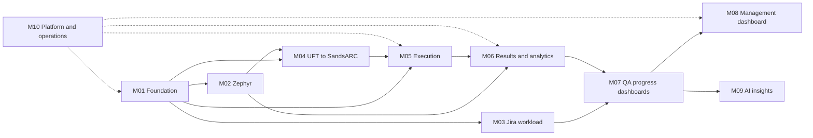

# Central QA Portal — Module Plan Index

This folder decomposes the master plan into independently workable modules.

The master plan remains the product-level source of truth:

- [Master plan](../CENTRAL_QA_PORTAL_PLAN.md)

These module files are execution plans. They may be implemented and reviewed independently, but changes that affect scope, definitions, architecture, or sequencing must be reflected back in the master plan during review.

## Module map

| ID | Module | File | Initial outcome |
|---|---|---|---|
| M01 | Foundation, taxonomy, and common access | [M01_FOUNDATION_TAXONOMY.md](M01_FOUNDATION_TAXONOMY.md) | A usable internal portal shell with MBS/SCL/application structure |
| M02 | Zephyr test management integration | [M02_ZEPHYR_TEST_MANAGEMENT.md](M02_ZEPHYR_TEST_MANAGEMENT.md) | Manual and automated test inventory synchronized from Zephyr |
| M03 | Jira workload and bandwidth | [M03_JIRA_WORKLOAD_BANDWIDTH.md](M03_JIRA_WORKLOAD_BANDWIDTH.md) | Team effort, assignment, blocker, and workload views without performance scoring |
| M04 | UFT-to-SandsARC migration | [M04_UFT_SANDSARC_MIGRATION.md](M04_UFT_SANDSARC_MIGRATION.md) | Migration inventory, linkage, validation, and progress tracking |
| M05 | Test execution orchestration | [M05_TEST_EXECUTION_ORCHESTRATION.md](M05_TEST_EXECUTION_ORCHESTRATION.md) | Safe UI-triggered runs through GitHub Actions and ADO |
| M06 | Result ingestion and quality data | [M06_RESULT_INGESTION_ANALYTICS.md](M06_RESULT_INGESTION_ANALYTICS.md) | Normalized runs, outcomes, artifacts, coverage, and freshness |
| M07 | QA progress dashboards | [M07_QA_PROGRESS_DASHBOARDS.md](M07_QA_PROGRESS_DASHBOARDS.md) | Manual QA, Automation QA, and Overall QA project-progress views |
| M08 | Management progress dashboard | [M08_MANAGEMENT_PROGRESS_DASHBOARD.md](M08_MANAGEMENT_PROGRESS_DASHBOARD.md) | Project/portfolio progress and capacity view; no individual KPI scoring |
| M09 | AI-assisted insights | [M09_AI_ASSISTED_INSIGHTS.md](M09_AI_ASSISTED_INSIGHTS.md) | Evidence-linked summaries and triage assistance |
| M10 | Platform, security, operations, and delivery | [M10_PLATFORM_SECURITY_OPERATIONS.md](M10_PLATFORM_SECURITY_OPERATIONS.md) | Azure runtime, observability, security baseline, and release readiness |

## Recommended execution sequence

## Parallel work

- **M01 + M10:** foundation and platform/security can start together.
- **M02 + M03:** Zephyr and Jira adapters can proceed in parallel once M01 defines application/team mappings.
- **M04:** can begin inventory work as soon as Zephyr IDs and current UFT/ADO assets are available.
- **M05:** can prototype one UFT/ADO flow and one SandsARC flow while M02–M04 are in progress.
- **M06:** needs at least one real UFT/ADO result and one SandsARC result sample.
- **M07–M09:** should use the stable normalized data contracts from earlier modules.

## Common module template

Every module file follows the same handoff structure:

1. Objective and boundaries
2. Dependencies and inputs
3. Proposed data/contracts
4. Workable backlog
5. Acceptance criteria
6. Open decisions
7. Handoff to the next module

## Global rules inherited from the master plan

- Initial phase: everyone in the intended internal audience can see everything; no portal role or team-scope logic.
- Future access: only two levels, `All QA` and `Management`.
- Metrics are project/team progress indicators, not individual performance KPIs.
- Jira named data is used only for workload, bandwidth, blockers, and support planning.
- Zephyr is the source of truth for manual and automated test cases.
- UFT is the legacy automation framework; SandsARC Java with Cucumber/TestNG is the target framework.
- New automation projects should use SandsARC.
- The master plan controls product scope if a module file appears to conflict with it.
